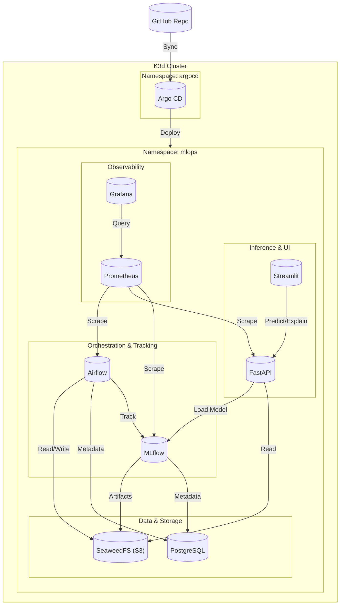
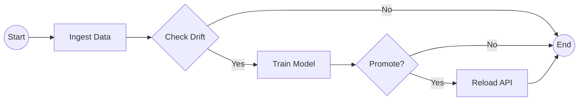

# MLOps Proyecto Final - End-to-End Kubernetes Platform

Este repositorio contiene la implementación completa de una plataforma MLOps End-to-End desplegada sobre Kubernetes (K3d) y gestionada vía GitOps con Argo CD.


##  Arquitectura



### Infraestructura
- **Kubernetes:** K3d (K3s en Docker) - Ideal para desarrollo local
- **GitOps:** Argo CD (Continuous Deployment desde Git)
- **Storage:** SeaweedFS (S3-compatible) + PostgreSQL
- **Networking:** NodePort Services
- **Observabilidad:** Prometheus + Grafana

### Componentes MLOps
- **Orquestación:** Apache Airflow con KubernetesExecutor y Git-Sync
  
- **Experiment Tracking:** MLflow (Backend: Postgres, Artifacts: SeaweedFS S3)
  
- **Model Serving:** FastAPI con endpoints de predicción y explicabilidad
- **Interpretabilidad:** SHAP TreeExplainer para explicaciones de predicciones
- **Frontend:** Streamlit con visualizaciones interactivas
  
- **CI/CD:** GitHub Actions para build, test y push de imágenes Docker
- **Monitoring:** Prometheus + Grafana con dashboards y alertas

##  Inicio Rápido

### Prerequisitos
- Docker Desktop (Windows/macOS) o Docker Engine (Linux)
- WSL2 (si estás en Windows)
- kubectl instalado
- 8GB RAM mínimo, 16GB recomendado
- 20GB de espacio en disco

### Despliegue Automatizado

```bash
# 1. Clonar el repositorio
git clone https://github.com/davidm094/MLOPS_Proyecto_Final.git
cd MLOPS_Proyecto_Final

# 2. Dar permisos de ejecución a los scripts
chmod +x scripts/*.sh

# 3. Ejecutar el despliegue completo
./scripts/start_mlops.sh
```

**Tiempo estimado:** 5-7 minutos

Este script:
1.  Crea un cluster K3d con puertos mapeados
2.  Instala y configura Argo CD
3.  Despliega toda la infraestructura (Postgres, SeaweedFS)
4.  Despliega las aplicaciones MLOps (Airflow, MLflow, API, Frontend)
5.  Despliega observabilidad (Prometheus, Grafana)
6.  Crea buckets S3 y tablas PostgreSQL necesarias
7.  Muestra las URLs de acceso y credenciales

##  Acceso a Servicios

| Servicio | URL | Credenciales |
|----------|-----|--------------|
| **Argo CD** | http://localhost:30443 | admin / (ver comando abajo) |
| **Airflow** | http://localhost:30080 | admin / admin |
| **MLflow** | http://localhost:30500 | - |
| **API (FastAPI)** | http://localhost:30800 | - |
| **Frontend (Streamlit)** | http://localhost:30501 | - |
| **Grafana** | http://localhost:30300 | admin / admin |
| **Prometheus** | http://localhost:30090 | - |

### Obtener Password de Argo CD
```bash
kubectl -n argocd get secret argocd-initial-admin-secret -o jsonpath='{.data.password}' | base64 -d && echo
```

##  Pipeline de Machine Learning

### Flujo del DAG


### Descripción de Tareas

| Tarea | Descripción |
|-------|-------------|
| `ingest_data` | Descarga datos de API externa, guarda en PostgreSQL + S3 backup |
| `check_drift` | Compara datos actuales vs referencia usando KS-test |
| `train_model` | Entrena XGBoost con Optuna, registra en MLflow con SHAP |
| `reload_api` | Notifica a la API para recargar el nuevo modelo |
| `end_pipeline` | Marca finalización del pipeline |

### Modelo y Features

- **Algoritmo:** XGBoost Regressor (con fallback a HistGradientBoosting)
- **Target:** Precio de propiedades inmobiliarias
- **Hyperparameter Tuning:** Optuna (10 trials)
- **Target Transform:** Log1p para mejor distribución
- **Features originales:**
  - `bed` - Número de habitaciones
  - `bath` - Número de baños
  - `acre_lot` - Tamaño del lote (acres)
  - `house_size` - Tamaño de la casa (sqft)
- **Features engineered:**
  - `state_price_mean` - Target encoding por estado
  - `is_sold` - Indicador binario
  - `bed_bath_interaction` - bed × bath
  - `size_per_bed` - house_size / (bed + 1)
  - `size_per_bath` - house_size / (bath + 1)
  - `total_rooms` - bed + bath
  - `lot_to_house_ratio` - acre_lot × 43560 / house_size

### Métricas Registradas
- **RMSE:** Root Mean Squared Error
- **MAE:** Mean Absolute Error
- **R²:** Coeficiente de determinación
- **MAPE:** Mean Absolute Percentage Error
- **CV R² Mean/Std:** Cross-validation metrics

### Auto-Promoción a Producción
El modelo se promueve automáticamente a "Production" si:
- R² ≥ 0.35
- RMSE ≤ $700,000

##  Explicabilidad con SHAP

### ¿Qué es SHAP?
SHAP (SHapley Additive exPlanations) es una técnica que explica las predicciones de modelos ML asignando a cada feature un valor de importancia para cada predicción individual.

### Implementación

1. **Durante el entrenamiento:**
   - Se genera un `TreeExplainer` para XGBoost
   - Se guarda como artefacto `shap_explainer.pkl` en MLflow/S3

2. **En la API (`/explain`):**
   - Carga el explainer desde S3
   - Calcula SHAP values para la entrada
   - Retorna valores, base value y nombres de features

3. **En el Frontend:**
   - Visualiza un gráfico de barras con contribuciones
   - Muestra tabla detallada de impacto por feature
   - Indica dirección del impacto (aumenta/disminuye precio)

### Ejemplo de Respuesta `/explain`
```json
{
  "price": 450000.0,
  "shap_values": [15000.5, -8000.2, 5000.0, 25000.8, 12000.0, ...],
  "base_value": 380000.0,
  "feature_names": ["bed", "bath", "acre_lot", "house_size", "state_price_mean", ...],
  "feature_values": [3.0, 2.0, 0.25, 1800.0, 800000.0, ...],
  "model_version": "5"
}
```

##  Observabilidad

### Prometheus Metrics
La API expone métricas en `/metrics`:
- `predictions_total` - Total de predicciones por estado y versión
- `prediction_latency_seconds` - Histograma de latencia
- `prediction_price_dollars` - Histograma de precios predichos
- `model_loaded` - Gauge indicando si el modelo está cargado
- `explainer_loaded` - Gauge indicando si SHAP está disponible

### Grafana Dashboards
Accede a http://localhost:30300 (admin/admin) para ver:
- **MLOps API Dashboard:** Requests/sec, latencia p50/p95/p99, error rate
- **Kubernetes Dashboard:** Uso de recursos, pods, deployments

### Alertas Configuradas
- API down > 1 minuto
- Latencia p95 > 2 segundos
- Error rate > 5%
- Modelo no cargado > 2 minutos

##  Almacenamiento de Datos

### PostgreSQL Tables
- `raw_data` - Datos crudos de la API externa
- `clean_data` - Datos preprocesados
- `inference_logs` - Registro de todas las predicciones
- `drift_history` - Historial de detección de drift
- `model_history` - Historial de modelos entrenados

### S3 Buckets (SeaweedFS)
- `mlflow-artifacts` - Artefactos de MLflow (modelos, SHAP)
- `data-raw` - Backup de datos crudos
- `airflow-logs` - Logs remotos de Airflow

##  Estructura del Proyecto

```
.
├── apps/
│   ├── airflow/
│   │   ├── dags/                 # DAGs de Airflow
│   │   │   ├── mlops_pipeline.py # DAG principal
│   │   │   └── src/              # Scripts de ML
│   │   │       ├── data_loader.py
│   │   │       ├── preprocessing.py
│   │   │       ├── drift_detection.py
│   │   │       └── model_training.py
│   │   ├── Dockerfile
│   │   └── requirements.txt
│   ├── api/
│   │   ├── src/main.py           # FastAPI con /predict, /explain, /metrics
│   │   ├── k8s/deployment.yaml
│   │   ├── Dockerfile
│   │   └── requirements.txt
│   └── frontend/
│       ├── src/app.py            # Streamlit con SHAP visualization
│       ├── k8s/deployment.yaml
│       ├── Dockerfile
│       └── requirements.txt
├── infra/
│   ├── argocd/
│   │   ├── applications/
│   │   │   ├── core-apps.yaml    # Aplicaciones principales
│   │   │   └── observability.yaml # Prometheus + Grafana
│   │   └── install/
│   │       └── install.yaml      # Manifiestos de Argo CD
│   └── manifests/
│       ├── secrets/              # Kubernetes Secrets
│       ├── services/             # NodePort services
│       ├── setup/                # Jobs de inicialización
│       └── observability/        # Alertas y dashboards
├── tests/
│   ├── test_api.py               # Tests unitarios de API
│   ├── test_pipeline.py          # Tests de pipeline ML
│   ├── conftest.py               # Fixtures de pytest
│   ├── requirements.txt          # Dependencias de tests
│   └── load/
│       ├── locustfile.py         # Tests de carga
│       └── locust.conf           # Configuración de Locust
├── scripts/
│   ├── start_mlops.sh            #  Script principal
│   ├── create_cluster.sh
│   └── bootstrap_argocd.sh
├── .github/
│   └── workflows/
│       └── ci.yaml               # GitHub Actions CI/CD
├── docs/
│   ├── DEPLOYMENT_LOG.md         # Bitácora detallada
│   ├── TECHNICAL_REPORT.md       # Reporte técnico
│   ├── PROJECT_STATUS.md         # Estado del proyecto
│   └── references/               # Referencias y guías
└── README.md
```

##  Documentación

- [Reporte Técnico Completo](docs/TECHNICAL_REPORT.md)
- [Estado del Proyecto](docs/PROJECT_STATUS.md)
- [Bitácora de Despliegue](docs/DEPLOYMENT_LOG.md)
- [Referencias](docs/references/)

##  Testing

### Tests Unitarios
```bash
# Instalar dependencias
pip install -r tests/requirements.txt

# Ejecutar tests
pytest tests/ -v --cov=apps

# Solo tests de API
pytest tests/test_api.py -v

# Solo tests de pipeline
pytest tests/test_pipeline.py -v
```

### Tests de Carga con Locust
```bash
# Instalar Locust
pip install locust

# Ejecutar con UI (acceder a http://localhost:8089)
locust -f tests/load/locustfile.py --host=http://localhost:30800

# Ejecutar headless (100 usuarios, 5 minutos)
locust -f tests/load/locustfile.py --host=http://localhost:30800 \
  --headless -u 100 -r 10 -t 5m
```

### Probar la API manualmente
```bash
# Predicción
curl -X POST http://localhost:30800/predict \
  -H "Content-Type: application/json" \
  -d '{"bed": 3, "bath": 2, "acre_lot": 0.25, "house_size": 1800, "state": "California"}'

# Explicación SHAP
curl -X POST http://localhost:30800/explain \
  -H "Content-Type: application/json" \
  -d '{"bed": 3, "bath": 2, "acre_lot": 0.25, "house_size": 1800, "state": "California"}'

# Health check
curl http://localhost:30800/health

# Métricas Prometheus
curl http://localhost:30800/metrics

# Información del modelo
curl http://localhost:30800/model

# Historial de predicciones
curl http://localhost:30800/predictions/history?limit=10

# Recargar modelo
curl -X POST http://localhost:30800/reload
```

##  CI/CD Pipeline

### GitHub Actions
El workflow `.github/workflows/ci.yaml` incluye:

1. **Tests:** pytest con cobertura
2. **Lint:** flake8 y black
3. **Build:** Imágenes Docker multi-stage
4. **Push:** Docker Hub con tags (sha, latest, v#)
5. **Security:** Trivy vulnerability scan
6. **Load Test:** Smoke test con Locust (en PRs)

### Configuración de Secretos
En GitHub → Settings → Secrets:
- `DOCKERHUB_USERNAME`: Usuario de Docker Hub
- `DOCKERHUB_TOKEN`: Token de acceso

### Actualización de Imágenes
```bash
# Forzar actualización de deployments
kubectl rollout restart deployment/api -n mlops
kubectl rollout restart deployment/frontend -n mlops
```

##  Comandos Útiles

### Gestión del Cluster
```bash
# Ver todos los pods
kubectl get pods -A

# Ver aplicaciones de Argo CD
kubectl get apps -n argocd

# Logs del scheduler de Airflow
kubectl logs -n mlops -l component=scheduler -c scheduler -f

# Logs de MLflow
kubectl logs -n mlops -l app.kubernetes.io/name=mlflow -f

# Detener cluster (conserva datos)
k3d cluster stop mlops-cluster

# Eliminar cluster
k3d cluster delete mlops-cluster
```

### Debugging
```bash
# Shell en un pod
kubectl exec -it <pod-name> -n mlops -- /bin/bash

# Ver eventos recientes
kubectl get events -n mlops --sort-by='.lastTimestamp' | tail -20

# Describir pod problemático
kubectl describe pod <pod-name> -n mlops

# Ver datos en PostgreSQL
kubectl exec -n mlops $(kubectl get pods -n mlops -l app.kubernetes.io/name=postgresql -o jsonpath="{.items[0].metadata.name}") \
  -- psql -U postgres -d mlops_data -c "SELECT COUNT(*) FROM inference_logs;"
```

##  Troubleshooting

### Pods en CrashLoopBackOff
```bash
kubectl logs <pod-name> -n mlops --previous
kubectl describe pod <pod-name> -n mlops
```

### Argo CD no sincroniza
```bash
# Hard refresh
kubectl delete application <app-name> -n argocd
kubectl apply -f infra/argocd/applications/core-apps.yaml
```

### MLflow no guarda artefactos
```bash
# Verificar buckets S3
kubectl exec -n mlops <scheduler-pod> -c scheduler -- python3 -c "
import boto3
s3 = boto3.client('s3', endpoint_url='http://seaweedfs-s3.mlops.svc:8333',
                  aws_access_key_id='any', aws_secret_access_key='any')
print([b['Name'] for b in s3.list_buckets()['Buckets']])
"
# Debe mostrar: ['airflow-logs', 'data-raw', 'mlflow-artifacts']
```

### API no carga modelo
```bash
# Verificar que hay artefactos
curl http://localhost:30800/health

# Forzar recarga
curl -X POST http://localhost:30800/reload
```

##  Referencias

- [K3d Documentation](https://k3d.io/)
- [Argo CD Documentation](https://argo-cd.readthedocs.io/)
- [Apache Airflow](https://airflow.apache.org/)
- [MLflow](https://mlflow.org/)
- [SHAP Documentation](https://shap.readthedocs.io/)
- [FastAPI](https://fastapi.tiangolo.com/)
- [Streamlit](https://streamlit.io/)
- [Prometheus](https://prometheus.io/)
- [Grafana](https://grafana.com/)
- [Locust](https://locust.io/)

##  Autores
Anderson Alvarado 
David Moreno 
Juan Peña

##  Licencia

Este proyecto es parte de un trabajo académico.
