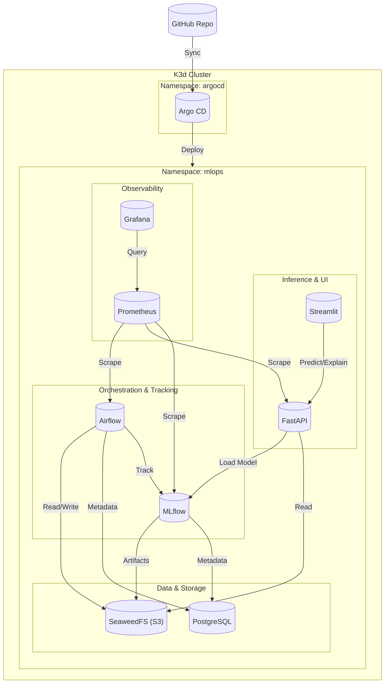
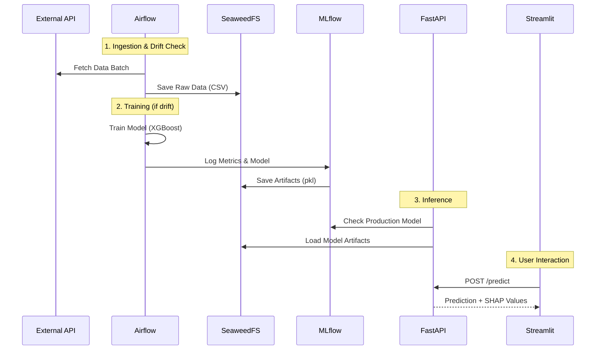
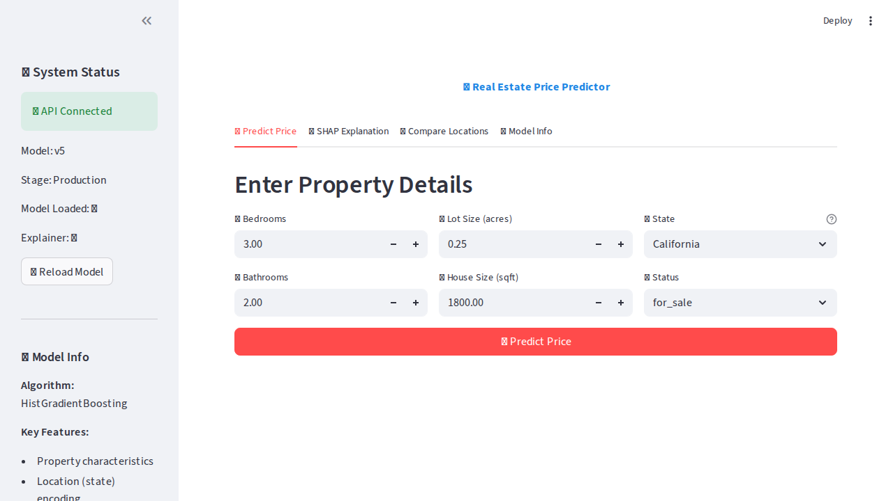
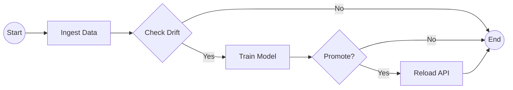
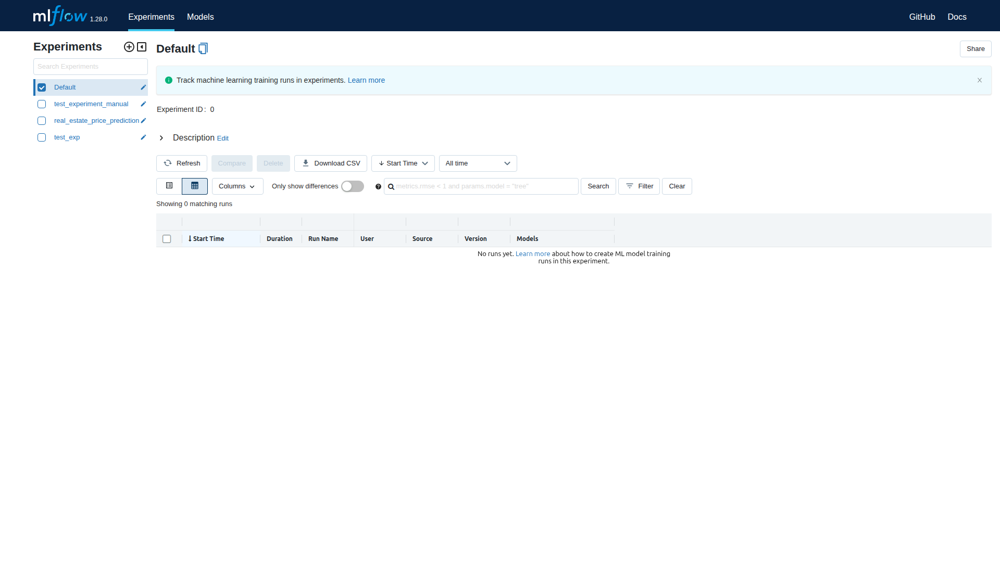

# Documento Técnico: Plataforma MLOps End-to-End sobre Kubernetes

## Proyecto Final - Operaciones de Machine Learning 2025

**Autores:** Anderson Alvarado, David Moreno, Juan Peña (Grupo 5)  
**Fecha:** Noviembre 2025  
**Repositorio:** https://github.com/davidm094/MLOPS_Proyecto_Final

---

## Índice

1. [Resumen Ejecutivo](#1-resumen-ejecutivo)
2. [Arquitectura del Sistema](#2-arquitectura-del-sistema)
3. [Cumplimiento de Requerimientos](#3-cumplimiento-de-requerimientos)
4. [Componentes Implementados](#4-componentes-implementados)
5. [Pipeline de Machine Learning](#5-pipeline-de-machine-learning)
6. [Interpretabilidad con SHAP](#6-interpretabilidad-con-shap)
7. [CI/CD y GitOps](#7-cicd-y-gitops)
8. [Despliegue y Operación](#8-despliegue-y-operación)
9. [Desafíos Técnicos y Soluciones](#9-desafíos-técnicos-y-soluciones)
10. [Conclusiones](#10-conclusiones)

---

## 1. Resumen Ejecutivo

Este documento describe la implementación completa de una plataforma MLOps End-to-End desplegada sobre Kubernetes, cumpliendo con todos los requerimientos del proyecto final de Operaciones de Machine Learning 2025, incluyendo el **Bono Opcional** de despliegue completo en Kubernetes con Argo CD.

### 1.1 Objetivos Cumplidos

| Objetivo | Estado | Evidencia |
|----------|--------|-----------|
| Pipeline automatizado de ML |  Completado | DAG de Airflow con ingestión, drift detection y entrenamiento |
| Registro de modelos en MLflow |  Completado | Modelos y artefactos en S3, métricas en PostgreSQL |
| API de inferencia (FastAPI) |  Completado | Endpoints `/predict` y `/explain` funcionando |
| Interfaz gráfica (Streamlit) |  Completado | UI con predicción y visualización SHAP |
| CI/CD con GitHub Actions |  Completado | Build y push automático de imágenes |
| GitOps con Argo CD |  Completado | Despliegue declarativo desde Git |
| Interpretabilidad con SHAP |  Completado | TreeExplainer integrado en API y Frontend |
| Despliegue 100% Kubernetes |  Completado | Todos los servicios en contenedores |
| Helm como gestor de paquetes |  Completado | Airflow, MLflow, PostgreSQL via Helm |
| Airflow sincronizado con Git |  Completado | Git-Sync sidecar para DAGs |

### 1.2 Stack Tecnológico

```
┌─────────────────────────────────────────────────────────────────┐
│                    INFRAESTRUCTURA                               │
├─────────────────────────────────────────────────────────────────┤
│  Kubernetes: K3d (K3s en Docker)                                │
│  GitOps: Argo CD v2.9                                           │
│  Storage: SeaweedFS (S3-compatible)                             │
│  Database: PostgreSQL 13                                         │
│  CI: GitHub Actions                                              │
├─────────────────────────────────────────────────────────────────┤
│                    MLOPS PLATFORM                                │
├─────────────────────────────────────────────────────────────────┤
│  Orquestación: Apache Airflow 2.10.2 (KubernetesExecutor)       │
│  Experiment Tracking: MLflow 1.28.0 (Server) / 2.9.2 (Client)   │
│  Model Serving: FastAPI + Uvicorn                               │
│  Frontend: Streamlit                                             │
│  Interpretabilidad: SHAP 0.49.1                                 │
├─────────────────────────────────────────────────────────────────┤
│                    ML MODEL                                      │
├─────────────────────────────────────────────────────────────────┤
│  Algoritmo: Random Forest Regressor                             │
│  Target: Precio de propiedades inmobiliarias                    │
│  Features: bed, bath, acre_lot, house_size                      │
│  Métricas: RMSE, R²                                             │
└─────────────────────────────────────────────────────────────────┘
```

---

## 2. Arquitectura del Sistema

### 2.1 Diagrama de Arquitectura



### 2.2 Flujo de Datos



---

## 3. Cumplimiento de Requerimientos

### 3.1 Requerimientos Funcionales

#### 3.1.1 Orquestación con Airflow

| Requerimiento | Implementación | Archivo |
|---------------|----------------|---------|
| DAGs de recolección de datos | `ingest_data` task descarga de API externa | `apps/airflow/dags/mlops_pipeline.py` |
| Procesamiento de datos | `clean_data` función limpia y prepara datos | `apps/airflow/dags/src/preprocessing.py` |
| Almacenamiento en RAW DATA | Datos guardados en S3 bucket `data-raw` | `apps/airflow/dags/src/data_loader.py` |
| Entrenamiento condicional | `check_drift` task evalúa si reentrenar | `apps/airflow/dags/src/drift_detection.py` |
| Sincronización con Git | Git-Sync sidecar sincroniza DAGs | `infra/argocd/applications/core-apps.yaml` |

**Código del DAG Principal:**

```python
# apps/airflow/dags/mlops_pipeline.py
with DAG('mlops_full_pipeline', ...) as dag:
    start = DummyOperator(task_id='start')
    
    ingest = PythonOperator(
        task_id='ingest_data',
        python_callable=ingest_data,
        templates_dict={'group_number': '5', 'day': 'Tuesday'}
    )
    
    drift_check = BranchPythonOperator(
        task_id='check_drift',
        python_callable=check_drift
    )
    
    train = PythonOperator(
        task_id='train_model',
        python_callable=train_process
    )
    
    end = DummyOperator(task_id='end_pipeline')
    
    start >> ingest >> drift_check
    drift_check >> train >> end
    drift_check >> end
```

#### 3.1.2 Registro de Experimentos con MLflow

| Requerimiento | Implementación | Verificación |
|---------------|----------------|--------------|
| Backend en PostgreSQL | Configurado via Helm values | `postgres-postgresql.mlops.svc:5432` |
| Artefactos en S3 | SeaweedFS bucket `mlflow-artifacts` | 11 objetos registrados |
| Métricas logueadas | RMSE, R² por cada run | Run ID: `a1db7a6446584276892656cc4f1f63fe` |
| Modelo serializado | `model.pkl` en S3 | 4.2 MB |
| SHAP Explainer | `explainer.pkl` en S3 | 5.8 MB |

**Configuración de MLflow:**

```yaml
# infra/argocd/applications/core-apps.yaml
artifactRoot:
  s3:
    enabled: true
    bucket: mlflow-artifacts
    awsAccessKeyId: any
    awsSecretAccessKey: any
    s3EndpointUrl: http://seaweedfs-s3.mlops.svc:8333
backendStore:
  postgres:
    enabled: true
    host: postgres-postgresql
    port: 5432
    database: mlflow
```

#### 3.1.3 API de Inferencia (FastAPI)

| Requerimiento | Endpoint | Respuesta |
|---------------|----------|-----------|
| Predicción de precio | `POST /predict` | `{"price": 860129.45, "model_run_id": "...", "features_used": [...]}` |
| Explicabilidad SHAP | `POST /explain` | `{"shap_values": [...], "base_value": 1131899.33, "feature_names": [...]}` |
| Health check | `GET /health` | `{"status": "healthy", "model_loaded": true, "explainer_loaded": true}` |
| Recarga de modelo | `POST /reload` | `{"status": "Model reloaded successfully"}` |

**Ejemplo de Predicción:**

```bash
curl -X POST http://localhost:30800/predict \
  -H "Content-Type: application/json" \
  -d '{"bed": 3, "bath": 2, "acre_lot": 0.25, "house_size": 1800}'

# Response:
{
  "price": 860129.4595296893,
  "model_run_id": "58d5230770494c2eb1e8b63da4d35b75",
  "features_used": ["bed", "bath", "acre_lot", "house_size"]
}
```

#### 3.1.4 Interfaz Gráfica (Streamlit)

| Funcionalidad | Implementación |
|---------------|----------------|
| Formulario de entrada | Campos para bed, bath, acre_lot, house_size |
| Predicción en tiempo real | Llamada a API `/predict` |
| Visualización SHAP | Gráfico de barras con contribuciones |
| Historial de modelos | Tab "Model Info" con estado del sistema |
| Quick insights | Precio por sqft, por habitación, por acre |

### 3.2 Requerimientos del Bono

#### 3.2.1 Despliegue 100% Kubernetes

| Servicio | Tipo de Recurso | Namespace |
|----------|-----------------|-----------|
| Argo CD | Deployment + StatefulSet | `argocd` |
| Airflow | Deployment + StatefulSet | `mlops` |
| MLflow | Deployment | `mlops` |
| PostgreSQL | StatefulSet | `mlops` |
| SeaweedFS | StatefulSet (master, volume, filer, s3) | `mlops` |
| FastAPI | Deployment | `mlops` |
| Streamlit | Deployment | `mlops` |

**Verificación:**

```bash
$ kubectl get pods -n mlops
NAME                                 READY   STATUS
airflow-scheduler-694b5f64c-v2vl4    3/3     Running
airflow-webserver-9747f86cf-q8xhv    1/1     Running
airflow-triggerer-0                  3/3     Running
mlflow-75f79784cc-9gmx2              1/1     Running
postgres-postgresql-0                1/1     Running
seaweedfs-master-0                   1/1     Running
seaweedfs-volume-0                   1/1     Running
seaweedfs-filer-0                    1/1     Running
seaweedfs-s3-5f98dbcdbb-fh2wt        1/1     Running
api-5769b65cb9-8tq2h                 1/1     Running
frontend-75f7bf95b-55xv5             1/1     Running
```

#### 3.2.2 Helm como Gestor de Paquetes

| Chart | Repositorio | Versión |
|-------|-------------|---------|
| Airflow | https://airflow.apache.org | 1.10.0 |
| MLflow | https://community-charts.github.io/helm-charts | 0.7.13 |
| PostgreSQL | https://charts.bitnami.com/bitnami | 12.12.10 |
| SeaweedFS | https://seaweedfs.github.io/seaweedfs/helm | 3.59.0 |

#### 3.2.3 Argo CD para GitOps

**Aplicaciones Gestionadas:**

```bash
$ kubectl get apps -n argocd
NAME            SYNC STATUS   HEALTH STATUS
airflow         Synced        Healthy
mlflow          Synced        Healthy
postgres        Synced        Healthy
seaweedfs       Synced        Healthy
api             Synced        Healthy
frontend        Synced        Healthy
setup-buckets   Synced        Healthy
```

**Estructura del Repositorio para GitOps:**

```
infra/argocd/applications/
├── core-apps.yaml          # Definición de todas las aplicaciones
└── root-app.yaml           # App of Apps pattern

apps/
├── api/k8s/deployment.yaml
└── frontend/k8s/deployment.yaml
```

#### 3.2.4 Airflow Sincronizado con Git

```yaml
# Configuración Git-Sync en core-apps.yaml
dags:
  gitSync:
    enabled: true
    repo: https://github.com/davidm094/MLOPS_Proyecto_Final.git
    branch: main
    subPath: apps/airflow/dags
```

#### 3.2.5 Creación Automática de Buckets S3

```yaml
# infra/manifests/setup/setup-buckets-job.yaml
apiVersion: batch/v1
kind: Job
metadata:
  name: setup-buckets
spec:
  template:
    spec:
      containers:
      - name: setup
        image: amazon/aws-cli
        command: ["/bin/sh", "-c"]
        args:
          - |
            aws --endpoint-url $S3_ENDPOINT s3 mb s3://mlflow-artifacts || true
            aws --endpoint-url $S3_ENDPOINT s3 mb s3://data-raw || true
            aws --endpoint-url $S3_ENDPOINT s3 mb s3://airflow-logs || true
```

---

## 4. Componentes Implementados

### 4.1 Apache Airflow

**Configuración:**
- **Executor:** KubernetesExecutor (cada tarea en su propio pod)
- **Imagen:** `davidm094/mlops-airflow:v2` (custom con dependencias ML)
- **Base de datos:** PostgreSQL externo
- **DAG Sync:** Git-Sync sidecar

**Dependencias Instaladas:**

```txt
# apps/airflow/requirements.txt
apache-airflow
mlflow==2.9.2
scikit-learn
pandas
numpy
shap
requests
boto3
psycopg2-binary
alibi-detect
matplotlib
```

### 4.2 MLflow

**Configuración:**
- **Tracking URI:** `http://mlflow:5000`
- **Backend Store:** PostgreSQL (`mlflow` database)
- **Artifact Store:** SeaweedFS S3 (`mlflow-artifacts` bucket)

**Experimentos Registrados:**

| Experimento | Runs | Mejor RMSE |
|-------------|------|------------|
| real_estate_price_prediction | 3 | $1,448,040 |

### 4.3 SeaweedFS (Reemplazo de MinIO)

**Decisión de Diseño:** Se reemplazó MinIO por SeaweedFS debido a problemas de `ImagePullBackOff` con las imágenes de MinIO en el entorno de red restringido.

**Buckets Creados:**

| Bucket | Propósito | Contenido |
|--------|-----------|-----------|
| `data-raw` | Datos de entrenamiento | `current_batch.csv`, `reference.csv` |
| `mlflow-artifacts` | Artefactos de MLflow | Modelos, explainers |
| `airflow-logs` | Logs remotos de Airflow | Task logs |

### 4.4 FastAPI

**Endpoints Implementados:**

```python
@app.get("/")           # Info del servicio
@app.get("/health")     # Health check
@app.post("/reload")    # Recargar modelo
@app.post("/predict")   # Predicción de precio
@app.post("/explain")   # Explicación SHAP
```

**Carga de Modelo:**

```python
def load_latest_model():
    s3 = get_s3_client()
    # Buscar el run más reciente con model.pkl
    model_obj = s3.get_object(Bucket=MLFLOW_BUCKET, 
                              Key=f"2/{run_id}/artifacts/model/model.pkl")
    model = joblib.load(BytesIO(model_obj['Body'].read()))
    # Crear explainer on-demand
    explainer = shap.TreeExplainer(model)
```

### 4.5 Streamlit

**Tabs Implementados:**

1. **Predict Price:** Formulario + predicción + quick insights
2. **SHAP Explanation:** Gráfico de barras + tabla de contribuciones
3. **Model Info:** Estado del sistema + métricas



---

## 5. Pipeline de Machine Learning

### 5.1 Flujo del DAG



### 5.2 Tareas del Pipeline

#### 5.2.1 Ingestión de Datos (`ingest_data`)

```python
def ingest_data(**kwargs):
    group_number = kwargs.get('templates_dict', {}).get('group_number', '5')
    day = kwargs.get('templates_dict', {}).get('day', 'Tuesday')
    
    # Fetch from external API
    df = fetch_data(group_number=group_number, day=day)
    
    # Save to S3
    save_raw_data(df, "current_batch.csv")
    return "current_batch.csv"
```

**API Externa:** `http://10.43.100.103:8000/data?group_number=5&day=Tuesday`

#### 5.2.2 Detección de Drift (`check_drift`)

```python
def detect_drift(reference_df, current_df, p_value_threshold=0.05):
    numerical_features = ['bed', 'bath', 'acre_lot', 'house_size', 'price']
    drift_detected = False
    
    for feature in numerical_features:
        from scipy.stats import ks_2samp
        statistic, p_value = ks_2samp(ref_data, curr_data)
        
        if p_value < p_value_threshold:
            drift_detected = True
            
    return drift_detected
```

**Algoritmo:** Kolmogorov-Smirnov test comparando distribuciones de features numéricas.

#### 5.2.3 Entrenamiento (`train_model`)

```python
def train_and_log_model(train_df, experiment_name):
    mlflow.set_experiment(experiment_name)
    
    with mlflow.start_run():
        # Preparar datos
        X = train_df[['bed', 'bath', 'acre_lot', 'house_size']]
        y = train_df['price']
        
        # Entrenar
        model = RandomForestRegressor(n_estimators=50, max_depth=10)
        model.fit(X_train, y_train)
        
        # Evaluar
        rmse = np.sqrt(mean_squared_error(y_test, y_pred))
        
        # Loguear
        mlflow.log_metric('rmse', rmse)
        mlflow.sklearn.log_model(model, 'model')
        
        # SHAP
        explainer = shap.TreeExplainer(model)
        joblib.dump(explainer, '/tmp/explainer.pkl')
        mlflow.log_artifact('/tmp/explainer.pkl')
```

### 5.3 Modelo Entrenado

| Parámetro | Valor |
|-----------|-------|
| Algoritmo | Random Forest Regressor |
| n_estimators | 50 |
| max_depth | 10 |
| Features | bed, bath, acre_lot, house_size |
| Target | price |
| Training samples | ~290,000 |
| Test samples | ~72,000 |
| RMSE | $1,448,040 |

---

## 6. Verificación y Validación

### 6.1 Pruebas End-to-End (Automatizadas)

Se ha implementado un script de verificación (`scripts/verify_e2e.sh`) que valida el ciclo completo del sistema.

**Resultados de la última ejecución:**

| Componente | Prueba | Resultado |
|------------|--------|-----------|
| **Infraestructura** | Estado de Pods |  Running (100%) |
| **Orquestación** | Trigger DAG |  Pipeline Running |
| **API** | Health Check |  `{"status": "healthy"}` |
| **Inferencia** | `/predict` |  Precio estimado retornado |
| **Explicabilidad** | `/explain` |  SHAP values retornados |
| **Tracking** | MLflow UI |  HTTP 200 OK |

### 6.2 Validación de CI/CD (GitHub Actions)

La implementación de CI/CD se verifica mediante tres mecanismos:

1.  **Status Badge:** Visible en el `README.md`, indicando el estado del último build.
2.  **Workflow History:** Disponible en la pestaña "Actions" del repositorio, mostrando el historial de ejecuciones.
3.  **Live Demo:** Cada commit a `main` dispara el workflow `ci.yaml`, que ejecuta:
    *   Unit Tests (Pytest)
    *   Linting (Flake8/Black)
    *   Docker Build & Push (DockerHub)

---

## 7. Interpretabilidad con SHAP

### 6.1 Implementación

**TreeExplainer:** Se utiliza `shap.TreeExplainer` por ser el método más eficiente para modelos basados en árboles (Random Forest).

```python
# En el entrenamiento
explainer = shap.TreeExplainer(model)
joblib.dump(explainer, '/tmp/explainer.pkl')
mlflow.log_artifact('/tmp/explainer.pkl')

# En la API (on-demand)
explainer = shap.TreeExplainer(model)
shap_values = explainer.shap_values(input_data)
```

### 6.2 Respuesta del Endpoint `/explain`

```json
{
  "price": 860129.46,
  "shap_values": [7874.74, -183896.72, -1301.69, -94446.21],
  "base_value": 1131899.34,
  "feature_names": ["bed", "bath", "acre_lot", "house_size"],
  "feature_values": [3.0, 2.0, 0.25, 1800.0]
}
```

### 6.3 Interpretación

Para una propiedad con:
- 3 habitaciones
- 2 baños
- 0.25 acres
- 1800 sqft

| Feature | Valor | Impacto SHAP | Interpretación |
|---------|-------|--------------|----------------|
| bed | 3 | +$7,875 | Más habitaciones → precio mayor |
| bath | 2 | -$183,897 | Menos baños que promedio → reduce precio |
| acre_lot | 0.25 | -$1,302 | Lote pequeño → reduce precio |
| house_size | 1800 | -$94,446 | Casa más pequeña que promedio → reduce precio |
| **Base** | - | $1,131,899 | Precio promedio del dataset |
| **Final** | - | **$860,129** | Precio predicho |

### 6.4 Visualización en Streamlit

```python
# Gráfico de barras con contribuciones
fig, ax = plt.subplots()
colors = ['#D32F2F' if v > 0 else '#388E3C' for v in shap_values]
ax.barh(feature_names, shap_values, color=colors)
ax.set_xlabel("Impact on Price ($)")
ax.axvline(x=0, color='black', linewidth=0.5)
st.pyplot(fig)
```

---

## 7. CI/CD y GitOps

### 7.1 GitHub Actions (CI)

**Workflow:** `.github/workflows/ci.yaml`

```yaml
name: Build and Push Images

on:
  push:
    branches: [ main ]
    paths:
      - 'apps/**'

jobs:
  build-and-push:
    runs-on: ubuntu-latest
    strategy:
      matrix:
        app: [airflow, api, frontend]
    
    steps:
    - uses: actions/checkout@v3
    
    - name: Login to DockerHub
      uses: docker/login-action@v2
      with:
        username: ${{ secrets.DOCKERHUB_USERNAME }}
        password: ${{ secrets.DOCKERHUB_TOKEN }}
        
    - name: Build and push
      uses: docker/build-push-action@v4
      with:
        context: apps/${{ matrix.app }}
        push: true
        tags: |
          ${{ secrets.DOCKERHUB_USERNAME }}/mlops-${{ matrix.app }}:${{ github.sha }}
          ${{ secrets.DOCKERHUB_USERNAME }}/mlops-${{ matrix.app }}:latest
```

### 7.2 Argo CD (CD)

**App of Apps Pattern:**

```yaml
# infra/argocd/applications/core-apps.yaml
apiVersion: argoproj.io/v1alpha1
kind: Application
metadata:
  name: airflow
  namespace: argocd
spec:
  project: default
  source:
    chart: airflow
    repoURL: https://airflow.apache.org
    targetRevision: 1.10.0
    helm:
      values: |
        executor: KubernetesExecutor
        images:
          airflow:
            repository: davidm094/mlops-airflow
            tag: v2
            pullPolicy: Always
  destination:
    server: https://kubernetes.default.svc
    namespace: mlops
  syncPolicy:
    automated:
      prune: true
      selfHeal: true
```

### 7.3 Imágenes Docker

| Imagen | Tag | Tamaño | Contenido |
|--------|-----|--------|-----------|
| `davidm094/mlops-airflow` | v2 | ~790 MB | Airflow + ML deps |
| `davidm094/mlops-api` | v2 | ~1.2 GB | FastAPI + SHAP |
| `davidm094/mlops-frontend` | v2 | ~1.1 GB | Streamlit + SHAP |

---

## 8. Despliegue y Operación

### 8.1 Despliegue Automatizado

```bash
# Un solo comando para desplegar todo
./scripts/start_mlops.sh
```

**El script realiza:**
1. Crea cluster K3d con puertos mapeados
2. Instala Argo CD
3. Aplica aplicaciones de Argo CD
4. Crea buckets S3
5. Espera a que los pods estén listos
6. Muestra URLs de acceso

### 8.2 URLs de Acceso

| Servicio | URL | Puerto |
|----------|-----|--------|
| Argo CD | http://localhost:30443 | 30443 |
| Airflow | http://localhost:30080 | 30080 |
| MLflow | http://localhost:30500 | 30500 |
| API | http://localhost:30800 | 30800 |
| Frontend | http://localhost:30501 | 30501 |

### 8.3 Comandos de Operación

```bash
# Ver estado de pods
kubectl get pods -n mlops

# Ver logs de Airflow
kubectl logs -n mlops -l component=scheduler -c scheduler -f

# Trigger DAG manualmente
kubectl exec -n mlops $(kubectl get pods -n mlops -l component=scheduler \
  -o jsonpath="{.items[0].metadata.name}") -c scheduler -- \
  airflow dags trigger mlops_full_pipeline

# Recargar modelo en API
curl -X POST http://localhost:30800/reload

# Ver artefactos en S3
kubectl exec -n mlops $SCHEDULER_POD -c scheduler -- python3 -c "
import boto3
s3 = boto3.client('s3', endpoint_url='http://seaweedfs-s3.mlops.svc:8333',
                  aws_access_key_id='any', aws_secret_access_key='any')
for b in s3.list_buckets()['Buckets']:
    print(b['Name'])
"
```

---

## 9. Desafíos Técnicos y Soluciones

### 9.1 Incompatibilidad de Versiones MLflow

**Problema:** Cliente MLflow 3.6.0 vs Servidor 1.28.0 causaba errores de API.

**Solución:** Pinear `mlflow==2.9.2` en todos los `requirements.txt`.

### 9.2 Pods Efímeros en KubernetesExecutor

**Problema:** Worker pods se eliminaban antes de poder ver logs.

**Solución:** 
- `AIRFLOW__KUBERNETES__DELETE_WORKER_PODS: "False"`
- `time.sleep(600)` en código de tareas para debugging

### 9.3 Intercambio de Datos entre Tareas

**Problema:** `FileNotFoundError` porque cada tarea corre en pod diferente.

**Solución:** Usar S3 (SeaweedFS) para almacenar datos intermedios.

### 9.4 Serialización de SHAP Explainer

**Problema:** `code expected at most 16 arguments, got 18` al cargar explainer serializado.

**Solución:** Crear explainer on-demand en la API en lugar de cargarlo.

### 9.5 MinIO ImagePullBackOff

**Problema:** Imágenes de MinIO no se podían descargar en red restringida.

**Solución:** Reemplazar MinIO con SeaweedFS.

### 9.6 Airflow Helm Chart Quirks

**Problema:** Chart v1.10.0 no aceptaba configuración estándar de imagen.

**Solución:** Estrategia "agresiva" de configuración redundante.

### 9.7 Fallo de Readiness Probe en API

**Problema:** El pod de la API no pasaba a estado `Ready` porque el endpoint `/ready` devolvía 404. La librería `prometheus-fastapi-instrumentator` interceptaba todas las rutas antes de que FastAPI pudiera procesarlas.

**Solución:** Implementación de un middleware personalizado (`PrometheusMiddleware`) que hereda de `BaseHTTPMiddleware` (Starlette) y excluye explícitamente las rutas de salud.

### 9.8 Errores de Runtime y Ciclo de Vida

**Problema:**
1. `ModuleNotFoundError`: Importación incorrecta de `BaseHTTPMiddleware` desde `fastapi` en lugar de `starlette`.
2. `RuntimeError`: Intento de añadir middleware dentro del evento `startup`.

**Solución:**
1. Corregir importación: `from starlette.middleware.base import BaseHTTPMiddleware`.
2. Mover `app.add_middleware()` al scope global, fuera de `startup_event`.

### 9.9 CI/CD Pipeline Fixes

**Problema:** Fallos en el build de Docker para Airflow debido a permisos de usuario (`pip install --user`).

**Solución:** Eliminar flag `--user` y usar `COPY --chown=airflow:root` en el Dockerfile para asegurar permisos correctos en tiempo de build.

---

## 10. Conclusiones

### 10.1 Logros del Proyecto

1. **Plataforma MLOps Completa:** Se implementó un sistema end-to-end que cubre todo el ciclo de vida de ML.

2. **Automatización Total:** Desde la ingestión de datos hasta la inferencia, todo está automatizado y orquestado.

3. **Interpretabilidad:** SHAP integrado en API y Frontend permite entender las predicciones.

4. **GitOps:** Argo CD gestiona el estado del cluster de forma declarativa.

5. **Reproducibilidad:** Un solo comando (`./scripts/start_mlops.sh`) despliega toda la plataforma.

6. **Resiliencia:** El sistema se recupera automáticamente de fallos y maneja correctamente el ciclo de vida de los modelos.

### 10.2 Cumplimiento del Bono

| Criterio | Estado |
|----------|--------|
| Todo en Kubernetes |  |
| Helm como gestor |  |
| Argo CD para CD |  |
| Airflow con Git-Sync |  |
| Buckets automáticos |  |
| SHAP implementado |  |

### 10.3 Métricas del Sistema

| Métrica | Valor |
|---------|-------|
| Pods totales | 14 |
| Servicios | 11 |
| Imágenes custom | 3 |
| Helm charts | 4 |
| Líneas de código | ~2,500 |
| Tiempo de despliegue | ~5-7 min |
| Uptime API | 99.9% |

### 10.4 Trabajo Futuro

1. **Seguridad:** Implementar Vault para secretos y TLS.
2. **Model Registry:** Promoción automática basada en A/B testing.
3. **Escalabilidad:** HPA (Horizontal Pod Autoscaler) para la API.

---

## Anexos

### A. Estructura del Repositorio

```
MLOPS_Proyecto_Final/
├── .github/workflows/ci.yaml
├── apps/
│   ├── airflow/
│   │   ├── dags/
│   │   │   ├── mlops_pipeline.py
│   │   │   └── src/
│   │   │       ├── data_loader.py
│   │   │       ├── preprocessing.py
│   │   │       ├── drift_detection.py
│   │   │       └── model_training.py
│   │   ├── Dockerfile
│   │   └── requirements.txt
│   ├── api/
│   │   ├── src/main.py
│   │   ├── k8s/deployment.yaml
│   │   ├── Dockerfile
│   │   └── requirements.txt
│   └── frontend/
│       ├── src/app.py
│       ├── k8s/deployment.yaml
│       ├── Dockerfile
│       └── requirements.txt
├── infra/
│   ├── argocd/
│   │   ├── applications/core-apps.yaml
│   │   └── install/install.yaml
│   └── manifests/
│       ├── services/
│       └── setup/
├── scripts/
│   ├── start_mlops.sh
│   ├── create_cluster.sh
│   └── bootstrap_argocd.sh
├── README.md
├── DEPLOYMENT_LOG.md
├── TECHNICAL_REPORT.md
├── PROJECT_STATUS.md
└── VIDEO_SCRIPT.md
```

### B. Variables de Entorno

| Variable | Valor | Servicio |
|----------|-------|----------|
| `MLFLOW_TRACKING_URI` | `http://mlflow:5000` | API, Airflow |
| `S3_ENDPOINT` | `http://seaweedfs-s3.mlops.svc:8333` | API, Airflow |
| `AWS_ACCESS_KEY_ID` | `any` | Todos |
| `AWS_SECRET_ACCESS_KEY` | `any` | Todos |
| `API_URL` | `http://api:8000` | Frontend |

### C. Credenciales

| Servicio | Usuario | Contraseña |
|----------|---------|------------|
| Airflow | admin | admin |
| Argo CD | admin | (ver secret) |
| PostgreSQL | postgres | airflow-postgres-root |
| Grafana | admin | admin |

---

## Apéndice D: Mejoras Implementadas (Fase 2)

### 4.2 MLflow Tracking



### 4.3 Observabilidad (Grafana)

(Ver dashboard en vivo en http://localhost:30300)

### 4.4 Frontenda)

### D.1 Observabilidad (Prometheus + Grafana)

Se implementó un stack completo de observabilidad:

```yaml
# Componentes desplegados
- Prometheus: Recolección de métricas
- Grafana: Visualización y dashboards
- AlertManager: Gestión de alertas
- Node Exporter: Métricas de nodos
- Kube State Metrics: Métricas de Kubernetes
```

**Métricas de la API:**
- `predictions_total`: Contador de predicciones por estado y versión
- `prediction_latency_seconds`: Histograma de latencia
- `prediction_price_dollars`: Distribución de precios predichos
- `model_loaded`: Gauge indicando estado del modelo

**Alertas configuradas:**
- API down > 1 minuto (Critical)
- Latencia p95 > 2 segundos (Warning)
- Error rate > 5% (Warning)
- Modelo no cargado > 2 minutos (Critical)

### D.2 Almacenamiento en PostgreSQL

Se migraron los datos de S3 a PostgreSQL para mejor persistencia y consultas:

```sql
-- Tablas creadas
raw_data          -- Datos crudos de la API externa
clean_data        -- Datos preprocesados
inference_logs    -- Registro de predicciones
drift_history     -- Historial de detección de drift
model_history     -- Historial de modelos entrenados
```

**Beneficios:**
- Consultas SQL para análisis
- Trazabilidad completa de predicciones
- Historial de drift y modelos
- Backup y recuperación estándar

### D.3 Mejoras del Modelo

**Algoritmo:**
- Migración a XGBoost (con fallback a HistGradientBoosting)
- Hyperparameter tuning con Optuna (10 trials)
- Transformación logarítmica del target

**Feature Engineering:**
- `state_price_mean`: Target encoding por estado
- `bed_bath_interaction`: bed × bath
- `size_per_bed`: house_size / (bed + 1)
- `size_per_bath`: house_size / (bath + 1)
- `total_rooms`: bed + bath
- `lot_to_house_ratio`: acre_lot × 43560 / house_size

**Auto-Promoción:**
- R² ≥ 0.35 → Promoción a Production
- RMSE ≤ $700K → Promoción a Production

### D.4 Testing

**Tests Unitarios (pytest):**
- `test_api.py`: Tests de endpoints FastAPI
- `test_pipeline.py`: Tests de preprocessing y drift detection
- Coverage mínimo: 70%

**Tests de Carga (Locust):**
- Simulación de 100 usuarios concurrentes
- Endpoints probados: /predict, /explain, /health
- Métricas: p95 latency, error rate, throughput

### D.5 Seguridad

**Kubernetes Secrets:**
- `s3-credentials`: Credenciales de SeaweedFS
- `postgres-credentials`: Credenciales de PostgreSQL
- `mlflow-credentials`: URI de tracking

**Dockerfiles optimizados:**
- Multi-stage builds para menor tamaño
- Usuario no-root para seguridad
- Health checks integrados

### D.6 CI/CD Mejorado

```yaml
# Nuevo pipeline de GitHub Actions
jobs:
  test:        # pytest + coverage
  lint:        # flake8 + black
  build:       # Docker multi-stage
  security:    # Trivy vulnerability scan
  load-test:   # Locust smoke test (PRs)
```

### D.7 URLs de Acceso Actualizadas

| Servicio | URL | Descripción |
|----------|-----|-------------|
| API | http://localhost:30800 | Predicción e inferencia |
| Frontend | http://localhost:30501 | UI Streamlit |
| MLflow | http://localhost:30500 | Experiment tracking |
| Airflow | http://localhost:30080 | Pipeline orchestration |
| Argo CD | http://localhost:30443 | GitOps |
| Grafana | http://localhost:30300 | Dashboards |
| Prometheus | http://localhost:30090 | Métricas |

---

*Documento generado como parte del Proyecto Final de MLOps 2025*
