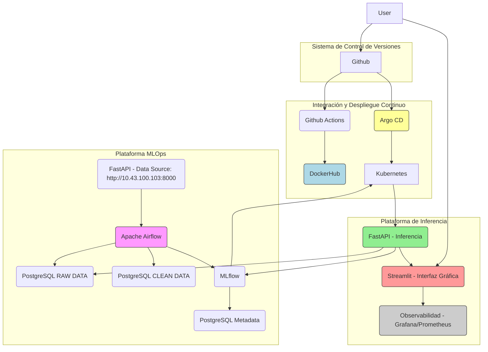

¡Claro\! Aquí tienes la descripción del proyecto final de "Operaciones de Machine Learning" en formato Markdown, basada en el documento que proporcionaste.

-----

# 🚀 Operaciones de Machine Learning - Proyecto Final

## 1\. Descripción

[cite\_start]Este proyecto final busca evaluar la comprensión, aplicación y explicación del ciclo de vida completo de un proyecto de Machine Learning (ML)[cite: 6]. [cite\_start]Se requiere la aplicación de los conceptos vistos en el curso, incluyendo el procesamiento de datos mediante *pipelines* completos que permitan el **entrenamiento continuo de modelos**[cite: 7].

[cite\_start]El proceso debe ser **automatizado** para identificar cambios en los datos que, a su vez, permitan realizar nuevos entrenamientos de forma automática, orquestado mediante una herramienta como AirFlow[cite: 8, 23].

  * [cite\_start]Cada modelo entrenado debe ser **registrado** para su uso potencial[cite: 9].
  * [cite\_start]El modelo con el **mejor desempeño** debe ser utilizado en un proceso de **inferencia** a través de una API en un contenedor[cite: 10].
  * [cite\_start]La imagen del contenedor de la API debe **crearse y publicarse de manera automática**[cite: 10, 17].
  * [cite\_start]El objetivo es desplegar todas las herramientas necesarias para ejecutar el procesamiento de datos y el entrenamiento de manera programada[cite: 11].
  * [cite\_start]Finalmente, se espera un **análisis del mejor modelo** en cada etapa y una explicación del por qué el cambio en el modelo hizo necesario un nuevo entrenamiento[cite: 12, 24].

### Herramientas y Requerimientos Clave

  * [cite\_start]Utilizar **AirFlow** para crear los **DAGs** de recolección, procesamiento y almacenamiento de datos[cite: 13, 23].
  * [cite\_start]Usar **MLflow** para el registro de experimentos y modelos[cite: 14]. [cite\_start]El modelo de inferencia debe tomar siempre el modelo definido en MLflow como **producción**, sin cambios en el código[cite: 22].
  * [cite\_start]Crear una **API** usando **FastAPI** que consuma el mejor modelo[cite: 15].
  * [cite\_start]Crear una **interfaz gráfica** usando **Streamlit** que permita realizar inferencia[cite: 16].
  * [cite\_start]Usar **GitHub Actions** para construir y publicar las imágenes de contenedores en DockerHub[cite: 17, 20, 89, 154].
  * [cite\_start]Realizar la **interpretación de los modelos** desplegados y sus cambios usando **SHAP**[cite: 18, 169].
  * [cite\_start]Integrar **Argo CD** para el despliegue automático en Kubernetes[cite: 19, 159].
  * [cite\_start]Todos los servicios/componentes deben estar en su **propio contenedor**[cite: 20].

-----

## 2\. Descripción del Dataset y Tarea

[cite\_start]El objetivo del dataset es **determinar el precio de una propiedad** (`price`) teniendo en cuenta el resto de sus características[cite: 34]. [cite\_start]El dataset se entregará por partes y debe ser recolectado progresivamente[cite: 35]. [cite\_start]A cada nuevo subconjunto de datos, se debe determinar si es necesario entrenar un nuevo modelo[cite: 36].

### 2.1. Cargar el Dataset

  * [cite\_start]Los datos se obtendrán a través de una **API externa** expuesta en la dirección IP: `http://10.43.100.103:8000`[cite: 38, 54].
  * [cite\_start]Esta API proporcionará un **subconjunto de datos diferente en cada petición**[cite: 39].
  * [cite\_start]Los estudiantes deben implementar un mecanismo para recolectar estos datos usando **Airflow**[cite: 40].
  * [cite\_start]Cada subconjunto de datos nuevos es insumo para un posible nuevo entrenamiento [cite: 41][cite\_start], el cual debe evaluarse para determinar si debe enviarse a producción[cite: 42].
  * [cite\_start]La secuencia de datos es la misma en relación al conteo de peticiones (no hay aleatoriedad)[cite: 48].

### [cite\_start]Descripción de Variables (Tabla 1) [cite: 32, 33]

| Variable | Descripción |
| :--- | :--- |
| `brokered_by` | agencia/corredor codificado categóricamente |
| `status` | estado de la vivienda (lista para la venta o lista para construir) |
| `price` | precio de la vivienda (cotización actual o precio de venta reciente) |
| `bed` | Número de camas |
| `bath` | Número de baños |
| `acre lot` | Tamaño del terreno/Propiedad en acres |
| `street` | dirección callejera codificada categóricamente |
| `city` | nombre de la ciudad |
| `state` | nombre del estado |
| `zip_code` | código postal de la zona |
| `house size` | área de la casa/tamaño/espacio habitable en pies cuadrados |
| `prev_sold_date` | Fecha de venta anterior |

-----

## 3\. Arquitectura de Referencia

[cite\_start]El proyecto propone una arquitectura para orquestar el proceso de ML mediante **AirFlow**, realizar seguimiento de experimentos con **MLflow**, y usar distintos componentes de almacenamiento[cite: 72]. [cite\_start]Todos los componentes se gestionan mediante Integración y Despliegue Continuo (CI/CD)[cite: 73].

  * [cite\_start]**AirFlow:** Orquesta el flujo de ejecución (recolección, procesamiento, entrenamiento)[cite: 72, 84].
  * [cite\_start]**MLflow:** Seguimiento de experimentos, registro de modelos, artefactos (modelo, métricas, código) y metadatos (parámetros, tiempos)[cite: 72, 75, 76, 77].
      * [cite\_start]Requiere una base de datos para metadatos y un sistema de archivos (bucket) para artefactos[cite: 78, 79].
  * [cite\_start]**PostgreSQL:** Se sugiere para las bases de datos: **RAW DATA**, **CLEAN DATA**, y **Metadata** de MLflow[cite: 57, 59, 62, 131].

### [cite\_start]🖼️ Diagrama de Arquitectura (Referencia) [cite: 65]

-----

## 4\. Componentes

[cite\_start]Cada componente debe estar en su propio contenedor y justificado técnicamente[cite: 98, 99, 100].

### 4.1. AirFlow (Orquestación)

  * [cite\_start]Encargado de orquestar la recolección, procesamiento y entrenamiento[cite: 117].
  * [cite\_start]Por cada petición a la API de datos, debe realizar el proceso completo (entrenamiento y publicación, si es necesario)[cite: 118].
  * [cite\_start]Almacena datos recolectados en **RAW DATA** y datos procesados en **CLEAN DATA**[cite: 120].
  * [cite\_start]Ejecuta el proceso de entrenamiento y registra los resultados en **MLflow**[cite: 121].

### 4.2. MLflow (Registro de Experimentos)

  * [cite\_start]Debe estar funcionando constantemente y tener conexión con un *bucket* (artefactos) y una base de datos (metadatos)[cite: 111, 112].
  * [cite\_start]El mejor modelo debe estar marcado como **producción**[cite: 114].
  * [cite\_start]Se deben mantener las versiones entrenadas de los distintos grupos de información[cite: 115].

### 4.3. FastAPI (Inferencia)

  * [cite\_start]Expone el modelo entrenado, que debe estar almacenado en MLflow[cite: 147].
  * [cite\_start]Debe consumir el modelo establecido con mejor desempeño, marcado con un TAG específico (sin requerir cambios de código ante un nuevo entrenamiento)[cite: 148, 149].
  * [cite\_start]Los **nuevos datos de inferencia deben ser almacenados** en la base de datos **RAW DATA**[cite: 150].

### 4.4. Inferencia UI (Streamlit)

  * [cite\_start]Permitirá usar el mejor modelo (el configurado como 'Production' en MLflow) a través de la API de FastAPI[cite: 138, 139].
  * [cite\_start]Se propone usar **Streamlit** para la interfaz gráfica[cite: 140].
  * Debe generar un apartado de **historial y explicabilidad** que muestre:
      * [cite\_start]Registro de modelos previamente entrenados[cite: 141].
      * [cite\_start]Cuáles fueron puestos en producción y cuáles no, con el criterio de rechazo[cite: 141].
      * [cite\_start]Desempeño en métricas de los modelos previos y del actual[cite: 141].
      * [cite\_start]Apartado de interpretabilidad usando **SHAP**[cite: 169].

### 4.5. Bases de Datos (PostgreSQL Sugerido)

  * [cite\_start]**Metadata (MLflow):** Contiene la información relativa a las ejecuciones de MLflow; no puede ser SQLite[cite: 129, 130].
  * [cite\_start]**CLEAN DATA:** Contiene la información procesada que se usa como insumo para la experimentación[cite: 133].
  * [cite\_start]**RAW DATA:** Contiene la información sin modificaciones, incluyendo los nuevos datos de inferencia[cite: 135, 150].

### 4.6. GitHub Actions (CI)

  * [cite\_start]Responsable del ciclo de Integración Continua[cite: 152].
  * [cite\_start]Debe construir las imágenes de contenedores de cada componente (Airflow, FastAPI, Streamlit, MLflow, etc.) y publicarlas en DockerHub[cite: 154].
  * [cite\_start]Toda actualización de código debe reflejarse en una **nueva versión de imagen versionada**[cite: 155].

### 4.7. Argo CD (CD)

  * [cite\_start]Implementa el ciclo de Despliegue Continuo (CD)[cite: 158].
  * [cite\_start]Observa los manifiestos versionados en Git y sincroniza automáticamente los cambios con el entorno de Kubernetes[cite: 159].

### 4.8. Observabilidad

  * [cite\_start]Compuesto por **Grafana** (visualización de datos) y **Prometheus** (recolección de métricas)[cite: 145].
  * [cite\_start]Como mínimo, debe recolectar información de la API de inferencia[cite: 144].
  * [cite\_start]**Bono Opcional:** Agregar los **ConfigMap** necesarios para tener el *dashboard* de Grafana listo sin carga manual[cite: 170].

-----

## 🎁 Apartado Opcional - Bono

[cite\_start]Se otorgará un bono adicional por desplegar **todo el sistema completamente sobre un entorno Kubernetes** utilizando **Argo CD**[cite: 163].

  * [cite\_start]Todos los servicios (Airflow, MLflow, API, Streamlit, Bases de Datos) deben estar definidos mediante manifiestos y gestionados dentro del clúster[cite: 164].
  * [cite\_start]Para el bono, se debe usar **HELM** como gestor de paquetes para Kubernetes[cite: 165].
  * [cite\_start]Airflow debe estar sincronizado con un repositorio de git[cite: 166].
  * [cite\_start]MinIO (si se usa para el *bucket*) debe crear automáticamente el *bucket* en caso de no existir[cite: 167].
